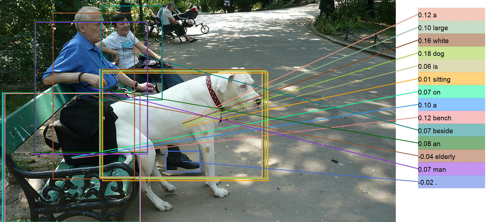
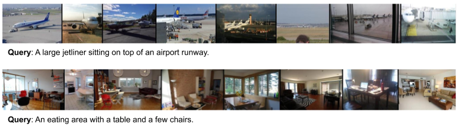

# Transformer Encoder Reasoning and Alignment Network (TERAN)

## Updates

- :fire: 09/2022: The extension to this work (**ALADIN: Distilling Fine-grained Alignment Scores for Efficient Image-Text Matching and Retrieval**) has been published in proceedings of CBMI 2022. Check out [code](https://github.com/mesnico/ALADIN) and [paper](https://arxiv.org/abs/2207.14757)!

## Introduction

Code for the cross-modal visual-linguistic retrieval method from "Fine-grained Visual Textual Alignment for Cross-modal Retrieval using Transformer Encoders", accepted for publication in ACM Transactions on Multimedia Computing, Communications, and Applications (TOMM) [[Pre-print PDF](https://arxiv.org/abs/2008.05231)].

This work is an extension to our previous approach TERN accepted at ICPR 2020.

This repo is built on top of [VSE++](https://github.com/fartashf/vsepp) and [TERN](https://github.com/mesnico/TERN).

<p align="center">
  <b>Fine-grained Alignment for Precise Matching</b> <br> <br>
  
</p>

<p align="center">
  <b>Retrieval</b> <br> <br>
  
</p>


## Setup

1. Clone the repo and move into it:
```
git clone https://github.com/mesnico/TERAN
cd TERAN
```

2. Setup python environment using conda:
```
conda env create --file environment.yml
conda activate teran
export PYTHONPATH=.
```

## Get the data
NOTE: Due to a NAS failure, the files below are temporarily moved to Google Drive and can be downloaded from there:
https://drive.google.com/drive/folders/17rZmJJdFQyRFHCn1PIEJT8HO6_Bj0Imi?usp=sharing

Unfortunately, we could not upload the pre-extracted features from Flickr-30k. File `features_36.tar` contains only those from MS-COCO. We hope to solve our NAS problem as soon as possible.

1. Download and extract the data folder, containing annotations, the splits by Karpathy et al. and ROUGEL - SPICE precomputed relevances for both COCO and Flickr30K datasets:

```
wget http://datino.isti.cnr.it/teran/data.tar
tar -xvf data.tar
```

2. Download the bottom-up features for both COCO and Flickr30K. We use the code by [Anderson et al.](https://github.com/peteanderson80/bottom-up-attention) for extracting them.
The following command extracts them under `data/coco/` and `data/f30k/`. If you prefer another location, be sure to adjust the configuration file accordingly.
```
# for MS-COCO
wget http://datino.isti.cnr.it/teran/features_36_coco.tar
tar -xvf features_36_coco.tar -C data/coco

# for Flickr30k
wget http://datino.isti.cnr.it/teran/features_36_f30k.tar
tar -xvf features_36_f30k.tar -C data/f30k
```

## Evaluate
Download and extract our pre-trained TERAN models:
```
wget http://datino.isti.cnr.it/teran/pretrained_models.tar
tar -xvf pretrained_models.tar
```

Then, issue the following commands for evaluating a given model on the 1k (5fold cross-validation) or 5k test sets.
```
python3 test.py pretrained_models/[model].pth --size 1k
python3 test.py pretrained_models/[model].pth --size 5k
```

Please note that if you changed some default paths (e.g. features are in another folder than `data/coco/features_36`), you will need to use the `--config` option and provide the corresponding yaml configuration file containing the right paths.
## Train
In order to train the model using a given TERAN configuration, issue the following command:
```
python3 train.py --config configs/[config].yaml --logger_name runs/teran
```
`runs/teran` is where the output files (tensorboard logs, checkpoints) will be stored during this training session.

## Visualization 

WIP

## Reference
If you found this code useful, please cite the following paper:

    @article{messina2021fine,
      title={Fine-grained visual textual alignment for cross-modal retrieval using transformer encoders},
      author={Messina, Nicola and Amato, Giuseppe and Esuli, Andrea and Falchi, Fabrizio and Gennaro, Claudio and Marchand-Maillet, St{\'e}phane},
      journal={ACM Transactions on Multimedia Computing, Communications, and Applications (TOMM)},
      volume={17},
      number={4},
      pages={1--23},
      year={2021},
      publisher={ACM New York, NY}
    }

## License

[Apache License 2.0](http://www.apache.org/licenses/LICENSE-2.0)
